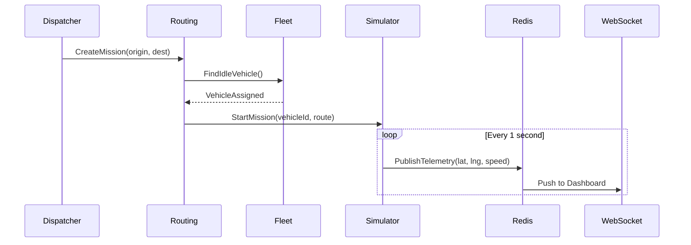

# Automatic Logistics Command Center

> Real-time autonomous fleet simulation platform — Clean Architecture, DDD, Event-Driven Design.

[](https://www.python.org/)
[](https://fastapi.tiangolo.com/)
[](https://www.postgresql.org/)
[](https://redis.io/)
[](https://www.docker.com/)
[](https://react.dev/)
[](https://expo.dev/)
[](https://threejs.org/)
[](LICENSE)

## Overview

**Automatic Logistics Command Center (ALCC)** simulates a worldwide autonomous transport company operating **1,000 virtual vehicles**. Each vehicle moves, consumes fuel, generates incidents, receives missions, and streams real-time telemetry at **1 Hz** — without any physical hardware.

## Features

| Module | Capabilities |
|--------|-------------|
| **Auth** | JWT authentication, RBAC (Admin, Operator, Dispatcher, Analyst) |
| **Fleet** | Vehicle CRUD, virtual drivers, state management, fleet stats |
| **Routing** | Mission creation, vehicle assignment, dispatch, completion |
| **Tracking** | Live telemetry, history, Redis-cached positions |
| **Simulator** | 1000-vehicle engine: movement, fuel, probabilistic incidents |
| **WebSocket** | Real-time dashboard feed via Redis Pub/Sub |
| **Notifications** | Alerts, incident tracking, resolution workflow |
| **Analytics** | Fleet/mission/incident KPIs, full dashboard summary |
| **Celery** | Async route optimization, maintenance scheduling, analytics |
| **Dashboard** | Built-in HTML command center with live KPIs |
| **Frontend** | React 18 SPA — 3D showroom, fleet globe, animated dashboards |
| **Mobile** | Expo React Native — iOS/Android with native 3D animations |
| **DevOps** | Docker Compose, GitHub Actions CI, Prometheus metrics |

## Architecture

### Principe général

ALCC applique le **Domain-Driven Design (DDD)** : le métier est découpé en **Bounded Contexts** autonomes, chacun pouvant devenir un **microservice** indépendant. Chaque service possède une responsabilité unique, communique via **API REST** ou **événements Redis Pub/Sub**, et possède sa propre logique métier.

```
Utilisateur / Dashboard
         │
         ▼
   API Gateway (FastAPI)  ← point d'entrée unique
         │
    ┌────┴────┬─────────┬──────────┬────────────┐
    │         │         │          │            │
  Auth     Fleet    Routing    Tracking    Notification
    │         │         │          │            │
    └─────────┴────Redis Pub/Sub───┴────────────┘
                    │
              Analytics + Celery Worker
```

**État actuel :** monolithe modulaire (`src/alcc/`) prêt pour un split microservices.  
**Cible :** 6 services métier + gateway, chacun avec sa propre base de données.

---

### Microservices — rôle de chaque module

#### 1. Auth Service — Authentification & autorisation

| | |
|---|---|
| **Code** | `src/alcc/auth/` |
| **Endpoints** | `/api/v1/auth/register`, `/login`, `/me` |
| **Rôle** | Gérer **qui** accède à la plateforme et **ce qu'il peut faire** |

**Responsabilités :**
- Inscription et connexion utilisateurs
- Émission de tokens **JWT**
- **RBAC** (contrôle d'accès par rôle) : `admin`, `dispatcher`, `operator`, `analyst`

**Pourquoi séparé ?** Domaine générique — tous les services en dépendent, aucun ne doit gérer les mots de passe à leur place.

---

#### 2. Fleet Service — Gestion de flotte

| | |
|---|---|
| **Code** | `src/alcc/fleet/` |
| **Entités** | `Vehicle`, `VirtualDriver` |
| **Endpoints** | `/api/v1/fleet/vehicles`, `/drivers`, `/stats` |

**Responsabilités :**
- CRUD véhicules (immatriculation, modèle, position)
- États : `idle`, `en_route`, `maintenance`, `incident`, `offline`
- Chauffeurs virtuels et assignation véhicule ↔ chauffeur
- Règles : 1 mission max, pas de mission en maintenance

**Événements :** `vehicle.registered`, `vehicle.state_changed`

---

#### 3. Routing Service — Missions & dispatch

| | |
|---|---|
| **Code** | `src/alcc/routing/` |
| **Entités** | `Mission`, `RouteWaypoint` |
| **Endpoints** | `/api/v1/missions` |

**Responsabilités :**
- Créer des missions (origine → destination)
- Calculer la distance (Haversine)
- Assigner un véhicule idle, démarrer et clôturer la mission
- Cycle : `pending` → `assigned` → `in_progress` → `completed`

**Interactions :** Fleet (véhicule disponible), Simulator (mouvement vers destination)

---

#### 4. Tracking Service — Télémétrie temps réel

| | |
|---|---|
| **Code** | `src/alcc/tracking/` |
| **Données** | lat, lng, vitesse, carburant, état — **1 Hz** |
| **Endpoints** | `/api/v1/tracking/vehicles/{id}/latest`, `/live` |

**Responsabilités :**
- Persister l'historique (PostgreSQL)
- Cache live Redis (TTL 10 s)
- Exposer la flotte entière en temps réel
- Marquer offline si données > 5 s

**Flux :** `Simulator → Redis Pub/Sub → Tracking → WebSocket → Dashboard`

---

#### 5. Notification Service — Alertes & incidents

| | |
|---|---|
| **Code** | `src/alcc/notification/` |
| **Entités** | `Notification`, `Incident` |
| **Endpoints** | `/api/v1/notifications`, `/incidents` |

**Responsabilités :**
- Alertes : carburant bas, incident, retard mission, maintenance
- Sévérité : `low`, `medium`, `high`, `critical`
- Workflow incident ouvert → résolu par opérateur

| Type | Déclencheur |
|------|-------------|
| `low_fuel` | Carburant < 10 % |
| `incident` | Panne simulée ou carburant à 0 % |
| `mission_delay` | Mission en retard |
| `maintenance` | Maintenance planifiée |

---

#### 6. Analytics Service — KPIs & reporting

| | |
|---|---|
| **Code** | `src/alcc/analytics/` |
| **KPIs** | `FleetKPIs`, `MissionKPIs`, `IncidentKPIs` |
| **Endpoints** | `/api/v1/analytics/fleet`, `/missions`, `/dashboard` |

**Responsabilités :**
- Taux d'utilisation flotte (objectif > 75 %)
- Taux de complétion missions
- Taux d'incidents
- Dashboard consolidé

---

### Services transverses

| Service | Code | Rôle |
|---------|------|------|
| **API Gateway** | `main.py` | Point d'entrée, JWT, dashboard HTML |
| **Simulator** | `simulator/` | 1000 véhicules simulés : mouvement, carburant, incidents |
| **WebSocket** | `shared/presentation/websocket.py` | Streaming temps réel via Redis Pub/Sub |
| **Celery Worker** | `worker/` | Tâches async : optimisation routes, maintenance, analytics |
| **Redis** | infra | Pub/Sub + cache télémétrie |
| **PostgreSQL** | infra | Persistance (source de vérité) |

---

### Communication inter-services

| Mode | Usage | Exemple |
|------|--------|---------|
| **Sync (REST)** | Actions immédiates | Assigner une mission |
| **Async (Redis Pub/Sub)** | Flux temps réel | Télémétrie 1 Hz |
| **Async (Celery)** | Calculs lourds | Optimisation routes |



---

### Classification DDD

| Domaine | Type | Raison |
|---------|------|--------|
| Fleet Management | **Core** | Cœur métier — cycle de vie véhicules |
| Real-Time Tracking | **Core** | Différenciateur — télémétrie 1 Hz à l'échelle |
| Routing & Missions | **Core** | Valeur opérationnelle — dispatch |
| Notifications | **Supporting** | Réaction aux événements |
| Analytics | **Supporting** | Insights sur les données core |
| Authentication | **Generic** | JWT/RBAC standard |

---

### Résumé en une phrase

| Service | En une phrase |
|---------|---------------|
| **Auth** | Qui es-tu et que peux-tu faire ? |
| **Fleet** | Quels véhicules existent et dans quel état ? |
| **Routing** | Où doivent-ils aller et quelle mission est assignée ? |
| **Tracking** | Où sont-ils **maintenant**, en temps réel ? |
| **Notification** | Qu'est-ce qui demande l'attention immédiate ? |
| **Analytics** | Comment performe la flotte sur la durée ? |

---

### Docker (recommended)

```bash
cp .env.example .env
docker compose up --build
```

| Service | URL |
|---------|-----|
| **React Frontend** | [http://localhost:3000](http://localhost:3000) |
| **API + Swagger** | [http://localhost:8000/docs](http://localhost:8000/docs) |
| **Backend Dashboard** | [http://localhost:8000](http://localhost:8000) |

### Frontend (React + Three.js)

Interface web professionnelle avec animations 3D, connectée à **tous** les microservices backend.

```bash
# Terminal 1 — backend
docker compose up api postgres redis
# ou: uvicorn alcc.main:app --reload --app-dir src

# Terminal 2 — frontend dev
cd frontend
npm install
npm run dev
```

Ouvrir [http://localhost:5173](http://localhost:5173) — le proxy Vite redirige `/api` et `/ws` vers le backend.

**Pages :**

| Route | Service API | Contenu |
|-------|-------------|---------|
| `/login` | Auth | Showroom 3D rotatif, particules, bloom |
| `/dashboard` | Analytics + Tracking + WS | KPIs animés, globe 3D temps réel |
| `/fleet` | Fleet | Cartes véhicules avec previews 3D (M-Series, X-Drive, i-Freight) |
| `/missions` | Routing | CRUD missions, assignation, complétion |
| `/tracking` | Tracking + WS | Globe fleet live, télémétrie WebSocket |
| `/notifications` | Notification | Alertes et résolution d'incidents |
| `/analytics` | Analytics | Graphiques Recharts animés |
| `/tasks` | Celery Worker | Déclenchement tâches async |

**Stack :** React 18 · Vite · TypeScript · Tailwind CSS · Framer Motion · React Three Fiber · TanStack Query · Zustand

### Mobile (Expo React Native)

Application mobile révolutionnaire iOS/Android avec animations 3D natives, connectée à **tous** les services backend.

```bash
# Backend accessible sur le réseau local
uvicorn alcc.main:app --reload --host 0.0.0.0 --app-dir src

cd mobile
cp .env.example .env   # IP LAN de votre machine
npm install
npx expo start
```

Scanner le QR code avec **Expo Go** ou lancer l'émulateur (`a` Android / `i` iOS).

| Tab | Service API | Contenu |
|-----|-------------|---------|
| Dashboard | Analytics + Tracking + WS | Globe 3D, KPIs animés |
| Flotte | Fleet | Showroom 3D par marque (M-Series, X-Drive, i-Freight) |
| Missions | Routing | CRUD, assignation, complétion |
| Tracking | Tracking + WS | Globe live, feed WebSocket |
| Alertes | Notification | Incidents + notifications |
| Analytics | Analytics | Graphiques SVG animés |
| Tasks | Celery Worker | Déclenchement tâches async |

**Stack mobile :** Expo 52 · React Native · Reanimated · React Three Fiber Native · TanStack Query · SecureStore

### Local Development

```bash
python -m venv .venv
source .venv/bin/activate  # Windows: .venv\Scripts\activate
pip install -r requirements-dev.txt
pip install -e .

# Start PostgreSQL + Redis (or use docker compose up postgres redis)
cp .env.example .env
python scripts/seed_users.py

uvicorn alcc.main:app --reload --app-dir src
```

### Default Users

| Email | Password | Role |
|-------|----------|------|
| admin@alcc.io | admin1234 | Admin |
| dispatcher@alcc.io | dispatch123 | Dispatcher |
| operator@alcc.io | operator123 | Operator |
| analyst@alcc.io | analyst123 | Analyst |

## API Endpoints

| Prefix | Description |
|--------|-------------|
| `/api/v1/auth` | Register, login, profile |
| `/api/v1/fleet` | Vehicles, drivers, fleet stats |
| `/api/v1/missions` | Mission lifecycle |
| `/api/v1/tracking` | Telemetry queries, live fleet |
| `/api/v1/notifications` | Alerts and incidents |
| `/api/v1/analytics` | KPIs and dashboard data |
| `/api/v1/tasks` | Celery async task triggers |
| `/ws/dashboard` | WebSocket real-time feed |
| `/health` | Health check |
| `/metrics` | Prometheus metrics |

## Project Structure

```
src/alcc/
├── auth/           # JWT, RBAC
├── fleet/          # Vehicles, virtual drivers
├── routing/        # Missions, dispatch
├── tracking/       # Telemetry
├── notification/   # Alerts, incidents
├── analytics/      # KPIs
├── simulator/      # 1000-vehicle engine
├── worker/         # Celery tasks
└── shared/         # Domain base, DB, Redis, WebSocket

frontend/src/
├── api/            # Axios client + all service modules
├── components/3d/  # VehicleModel, ShowroomScene, FleetGlobe
├── pages/          # Login, Dashboard, Fleet, Missions, Tracking…
├── hooks/          # WebSocket hook
└── store/          # Zustand auth persistence

mobile/
├── app/            # Expo Router screens (tabs + login)
├── src/api/        # Axios + all REST services
├── src/components/3d/  # R3F native vehicle models, globe
├── src/hooks/      # WebSocket hook
└── src/store/      # SecureStore auth persistence
```

## Testing

Chaque module possède sa **suite de tests dédiée** et un **script d'exécution**.

### Structure des tests

```
tests/
├── shared/         # Domain base, Result, exceptions
├── auth/           # Domain, JWT security, API
├── fleet/          # Vehicle, VirtualDriver, API
├── routing/        # Mission lifecycle, dispatch API
├── tracking/       # Telemetry, repository, API
├── notification/   # Alerts, incidents, API
├── analytics/      # KPIs, dashboard API
├── simulator/      # Fleet seeding, movement engine
├── worker/         # Celery tasks, async API
└── integration/    # Health, metrics, E2E flow
```

### Lancer tous les tests

```bash
# Linux / macOS / CI
bash scripts/tests/run_all.sh

# Windows PowerShell
.\scripts\tests\run_all.ps1 -Module all

# Python (multi-plateforme)
python scripts/tests/run_module.py all --cov
```

### Lancer les tests par module

| Module | Script | Commande directe |
|--------|--------|------------------|
| Shared | `scripts/tests/test_shared.sh` | `python scripts/tests/run_module.py shared` |
| Auth | `scripts/tests/test_auth.sh` | `python scripts/tests/run_module.py auth` |
| Fleet | `scripts/tests/test_fleet.sh` | `python scripts/tests/run_module.py fleet` |
| Routing | `scripts/tests/test_routing.sh` | `python scripts/tests/run_module.py routing` |
| Tracking | `scripts/tests/test_tracking.sh` | `python scripts/tests/run_module.py tracking` |
| Notification | `scripts/tests/test_notification.sh` | `python scripts/tests/run_module.py notification` |
| Analytics | `scripts/tests/test_analytics.sh` | `python scripts/tests/run_module.py analytics` |
| Simulator | `scripts/tests/test_simulator.sh` | `python scripts/tests/run_module.py simulator` |
| Worker | `scripts/tests/test_worker.sh` | `python scripts/tests/run_module.py worker` |
| Integration | `scripts/tests/test_integration.sh` | `python scripts/tests/run_module.py integration` |

### Couverture par type de test

| Type | Contenu |
|------|---------|
| **Unit — Domain** | Entités, règles métier, value objects, événements |
| **Unit — Security** | Hash password, JWT encode/decode |
| **Unit — Worker** | Tâches Celery (mode eager) |
| **Integration — API** | Endpoints REST, RBAC, codes HTTP |
| **Integration — Repository** | Persistance SQLAlchemy |
| **E2E** | Flux complet : véhicule → mission → dispatch → complétion |

### CI/CD

GitHub Actions exécute automatiquement :
1. **Lint** — `ruff check`
2. **Tests par module** — matrice parallèle (10 jobs)
3. **Couverture globale** — `pytest --cov=alcc`

---

```
docs/
├── design/
│   └── 01-business-analysis.md
└── architecture/
```

## Author

**Miguel** — [GitHub @ngmiguel](https://github.com/ngmiguel)

## License

MIT — see [LICENSE](LICENSE) for details.
