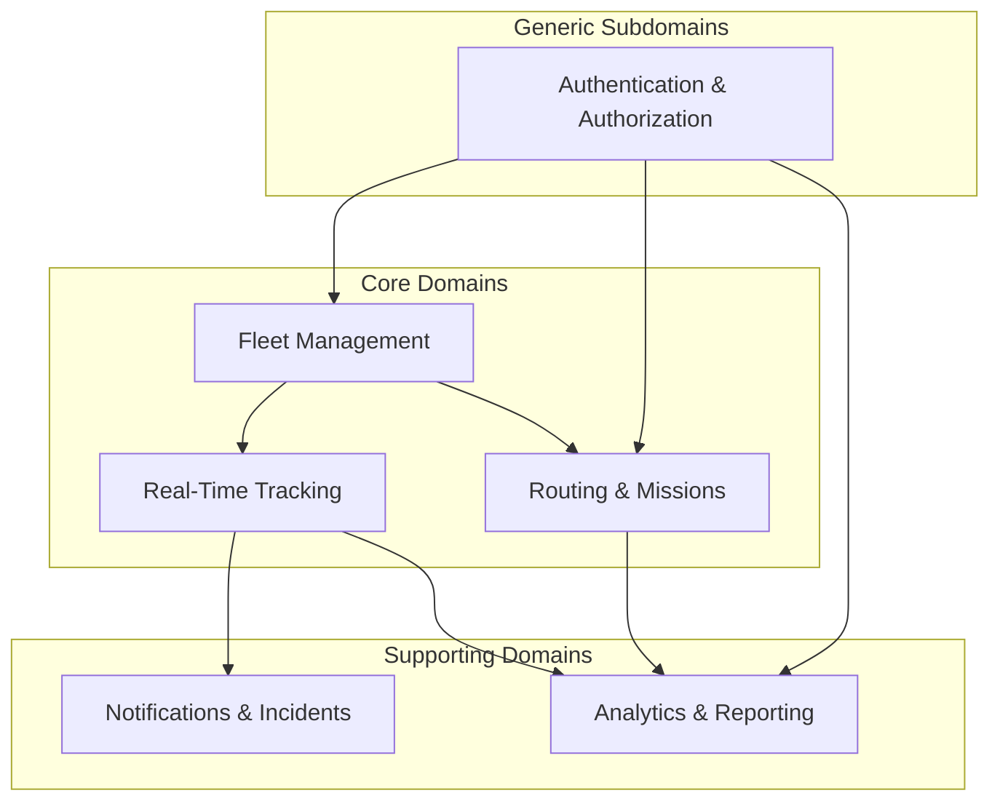
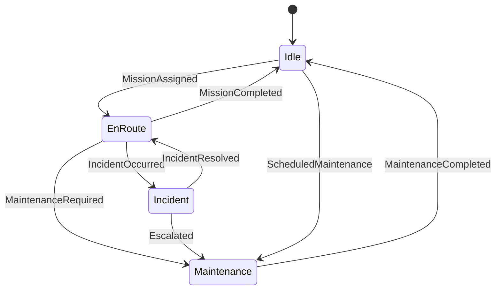
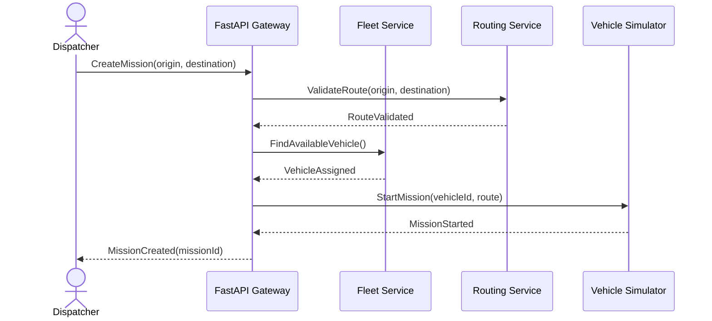
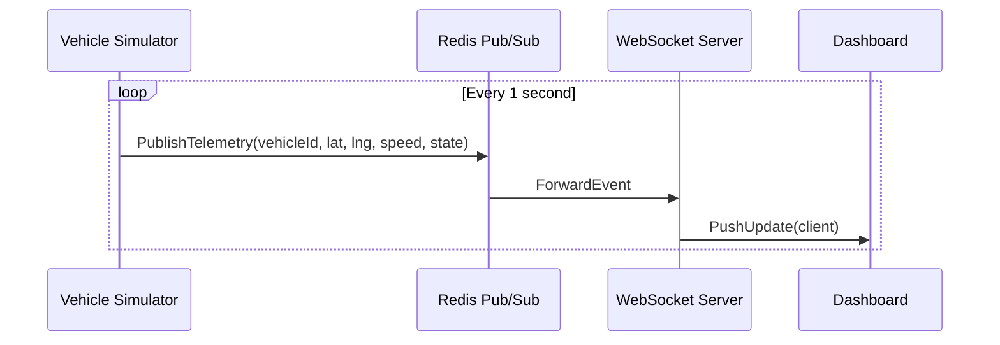

# Business Analysis — Automatic Logistics Command Center

## 1. Executive Summary

**Automatic Logistics Command Center (ALCC)** is a software platform that simulates the operations of a global autonomous transport company. The system manages **1,000 virtual vehicles** distributed worldwide, each capable of autonomous movement, fuel consumption, incident generation, mission execution, and real-time telemetry streaming.

The platform targets **fleet operators**, **dispatchers**, and **analysts** who need a unified command interface to monitor, control, and optimize autonomous logistics operations — without relying on physical hardware.

---

## 2. Business Vision

| Dimension | Description |
|-----------|-------------|
| **Problem** | Global logistics companies need centralized visibility and control over large autonomous fleets operating 24/7 across multiple regions. |
| **Solution** | A real-time command center that simulates fleet behavior, streams live telemetry, and provides operational dashboards with extensibility for AI-driven optimization. |
| **Value Proposition** | Reduce operational blind spots, improve dispatch efficiency, and enable data-driven decisions through continuous simulation and analytics. |
| **Scope (MVP)** | Fleet management, real-time tracking (1 Hz), mission assignment, incident handling, basic analytics. |
| **Scope (Future)** | Route optimization, fuel optimization, predictive maintenance via Celery workers and ML pipelines. |

---

## 3. Stakeholders & Actors

### 3.1 Primary Actors

| Actor | Role | Goals |
|-------|------|-------|
| **Fleet Operator** | Supervises the global fleet | Monitor vehicle health, respond to incidents, ensure SLA compliance |
| **Dispatcher** | Assigns and tracks missions | Optimize mission allocation, minimize idle time, track delivery progress |
| **Analyst** | Consumes operational data | Generate KPIs, identify trends, support strategic decisions |
| **System Administrator** | Manages platform access | Configure users, roles, system parameters |

### 3.2 System Actors

| Actor | Role |
|-------|------|
| **Vehicle Simulator** | Generates movement, fuel consumption, and incidents for 1,000 vehicles |
| **Telemetry Engine** | Publishes position, speed, and state updates every second |
| **Notification Service** | Delivers alerts and incident reports to operators |
| **Analytics Engine** | Aggregates telemetry and mission data into dashboards |

---

## 4. Business Capabilities

### 4.1 Capability Map

### 4.2 Capability Descriptions

| Capability | Type | Description |
|------------|------|-------------|
| **Fleet Management** | Core | Register vehicles, manage virtual drivers, track lifecycle states (idle, en route, maintenance, incident) |
| **Real-Time Tracking** | Core | Stream latitude, longitude, speed, and state at 1 Hz via WebSocket |
| **Routing & Missions** | Core | Create missions, assign routes, track completion |
| **Notifications** | Supporting | Alert operators on incidents, low fuel, mission delays |
| **Analytics** | Supporting | Compute KPIs: fleet utilization, incident rate, average speed, fuel efficiency |
| **Authentication** | Generic | JWT-based access control with role-based permissions |

---

## 5. Vehicle Lifecycle

Each simulated vehicle follows a defined state machine:

### Vehicle Attributes

| Attribute | Type | Update Frequency |
|-----------|------|------------------|
| Vehicle ID | UUID | Static |
| Latitude / Longitude | Decimal degrees | 1 Hz |
| Speed | km/h | 1 Hz |
| Fuel Level | Percentage (0–100) | 1 Hz |
| State | Enum | On transition |
| Assigned Mission | Mission ID (nullable) | On assignment |
| Virtual Driver | Driver ID | Static per vehicle |

---

## 6. Business Rules

### 6.1 Fleet Rules

| ID | Rule |
|----|------|
| BR-F01 | A vehicle can hold at most **one active mission** at a time. |
| BR-F02 | A vehicle in **Maintenance** or **Incident** state cannot receive a new mission. |
| BR-F03 | Each vehicle must have an assigned **virtual driver** before entering EnRoute state. |
| BR-F04 | Fleet size is capped at **1,000 active vehicles** in the simulation. |

### 6.2 Tracking Rules

| ID | Rule |
|----|------|
| BR-T01 | Telemetry updates must be published at **minimum 1 Hz** (every second). |
| BR-T02 | Position data must include latitude, longitude, speed, and state. |
| BR-T03 | Stale telemetry (> 5 seconds old) is flagged as **offline** in the dashboard. |

### 6.3 Mission Rules

| ID | Rule |
|----|------|
| BR-M01 | A mission must have a defined **origin** and **destination**. |
| BR-M02 | Only vehicles in **Idle** state are eligible for mission assignment. |
| BR-M03 | Mission completion is triggered when the vehicle reaches the destination coordinates. |

### 6.4 Fuel & Incident Rules

| ID | Rule |
|----|------|
| BR-FL01 | Fuel decreases proportionally to distance traveled and speed. |
| BR-FL02 | When fuel drops below **10%**, a low-fuel notification is generated. |
| BR-FL03 | At **0% fuel**, the vehicle transitions to **Incident** state automatically. |
| BR-IN01 | Incidents are generated probabilistically during EnRoute state (configurable rate). |
| BR-IN02 | Each incident has a severity level: **Low**, **Medium**, **High**, **Critical**. |

---

## 7. Key Business Processes

### 7.1 Mission Dispatch Flow

### 7.2 Real-Time Telemetry Flow

---

## 8. Non-Functional Requirements

| Category | Requirement |
|----------|-------------|
| **Performance** | Support 1,000 concurrent telemetry streams at 1 Hz (~1,000 msg/s) |
| **Latency** | Dashboard update latency < 500 ms end-to-end |
| **Availability** | 99.9% uptime target for API and WebSocket services |
| **Scalability** | Horizontal scaling via Redis Pub/Sub and stateless FastAPI workers |
| **Security** | JWT authentication, RBAC (Operator, Dispatcher, Analyst, Admin) |
| **Observability** | Structured logging, health checks, metrics endpoints |
| **Testability** | Unit, integration, and E2E test coverage for all bounded contexts |

---

## 9. Domain Classification (Strategic Design)

| Domain | Classification | Rationale |
|--------|---------------|-----------|
| Fleet Management | **Core** | Central to business — vehicle lifecycle is the heart of the platform |
| Real-Time Tracking | **Core** | Differentiator — live 1 Hz telemetry at scale |
| Routing & Missions | **Core** | Drives operational value — mission assignment and completion |
| Notifications | **Supporting** | Enables operator response but not a competitive differentiator |
| Analytics | **Supporting** | Provides insights but relies on core domain data |
| Authentication | **Generic** | Standard JWT/RBAC — use established patterns |

---

## 10. Success Metrics (KPIs)

| KPI | Target | Measurement |
|-----|--------|-------------|
| Fleet Utilization Rate | > 75% | Vehicles EnRoute / Total Active |
| Average Mission Completion Time | Baseline TBD | Time from assignment to completion |
| Incident Rate | < 5% of active missions | Incidents / Active Missions per hour |
| Telemetry Freshness | > 99% under 2s | Updates received within 2s / Total expected |
| System Throughput | 1,000 msg/s sustained | Redis Pub/Sub message rate |
| API Response Time (p95) | < 200 ms | FastAPI endpoint latency |

---

## 11. Glossary

| Term | Definition |
|------|------------|
| **Vehicle** | A simulated autonomous transport unit with GPS, fuel, and state |
| **Virtual Driver** | Software agent assigned to a vehicle, enabling EnRoute operations |
| **Mission** | A transport task with defined origin, destination, and assigned vehicle |
| **Telemetry** | Real-time data packet: position, speed, fuel, state |
| **Incident** | An unexpected event (breakdown, low fuel, collision) requiring operator attention |
| **Command Center** | The web dashboard providing real-time fleet visibility and control |
| **Bounded Context** | A DDD boundary defining a cohesive domain model (Fleet, Tracking, etc.) |

---

## 12. Assumptions & Constraints

### Assumptions

- No physical vehicles or IoT hardware — all data is simulated.
- Single-tenant deployment for the portfolio demonstration.
- PostgreSQL is the system of record; Redis is ephemeral cache and message broker.

### Constraints

- Python 3.11+ as the primary language.
- Clean Architecture + DDD must be respected in code structure.
- All design artifacts must precede implementation (design-first approach).

---

## 13. Next Steps

| Step | Deliverable |
|------|-------------|
| 2 | Event Storming workshop output |
| 3 | Bounded Contexts & Context Map |
| 4 | Use Cases & User Stories |
| 5 | System & Container diagrams (C4) |
